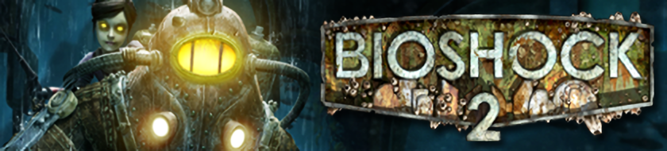

 

# Splicer Modification

## Table of Contents
- [Splicer Ids](#splicer-ids)
- [Mask Ids](#mask-ids)
- [Melee Ids](#melee-ids)
- [Unique Ids](#unique-ids)
- [Examples](#examples)
    - [Zigo](#example-1)
    - [Danny](#example-2)
    - [Barbara](#example-3)
- [Notes](#notes)

# Splicer Ids

| Blanche | Naledi | Jacob | Barbara | Buck | Zigo | Danny | Oscar | Suresh | Louie
|:-------:|:------:|:-----:|:-----:|:-----:|:-----:|:-----:|:-----:|:-----:|:-----:|
| 0 | 1  | 2 | 3 | 4 | 5 | 6 | 7 | 8 | 9 |

# Mask Ids

>  = None.
> Some characters use **-1** as their `None` option. If they do not have this option, they will use their **Unique Mask** instead.

| Mask | Blanche | Naledi | Jacob | Barbara | Buck | Zigo | Danny | Oscar | Suresh | Louie |
|:----:|:-------:|:------:|:-----:|:-------:|:----:|:----:|:-----:|:-----:|:------:|:-----:|
|  | -1 |-1 |-1 |-1 |-1 |-1 |-1 |-1 |-1 |-1 |
|  | 2 | 2 | 4 | 1 | 2 | 3 | 2 | 2 | 3 | 2 |  
|  | 3 | 3 | 5 | 2 | 3 | 4 | 3 | 3 | 4 | 3 |  
|  | 4 | 4 | 6 | 3 | 4 | 5 | 4 | 4 | 5 | 4 |  
|  | 5 | 5 | 7 | 4 | 5 | 6 | 5 | 5 | 6 | 5 |  
|  | 6 | 6 | 8 | 5 | 6 | 7 | 6 | 6 | 7 | 6 |  
|  | 7 | 7 | 9 | 6 | 7 | 8 | 7 | 7 | 8 | 7 |  
|  | 8 | 8 | 10 | 7 | 8 | 9 | 8 | 8 | 9 | 8 |  
|  | 9 | 9 | 11 | 8 | 9 | 10 | 9 | 9 | 10 | 9 |  
|  | 10 | 10 | 12 | 9 | 10 | 11 | 10 | 10 | 11 | 10 |  
| 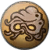 | 11 | 11 | 13 | 10 | 11 | 12 | 11 | 11 | 12 | 11 |  
| 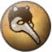 | 12 | 12 | 14 | 11 | 12 | 13 | 12 | 12 | 13 | 12 |  
|  | 13 | 13 | 15 | 12 | 13 | 14 | 13 | 13 | 14 | 13 |  
|  | 14 | 14 | 16 | 13 | 14 | 15 | 14 | 14 | 15 | 14 |  
|  | 15 | 15 | 17 | 14 | 15 | 16 | 15 | 15 | 16 | 15 |  
|  | 16 | 16 | 18 | 15 | 16 | 17 | 16 | 16 | 17 | 16 |  
| 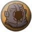 | 17 | 17 | 19 | 16 | 17 | 18 | 17 | 17 | 18 | 17 |  
|  | 28 | 28 | 30 | 27 | 28 | 29 | 28 | 28 | 29 | 28 |  
|  | 29 | 29 | 31 | 28 | 29 | 30 | 29 | 29 | 30 | 29 |  

# Melee Ids
>  = None.
> They will use their **Unique Melee** instead.

| Mask | Blanche | Naledi | Jacob | Barbara | Buck | Zigo | Danny | Oscar | Suresh | Louie |
|:----:|:-------:|:------:|:-----:|:-------:|:----:|:----:|:-----:|:-----:|:------:|:-----:|
|  | -1 |-1 |-1 |-1 |-1 |-1 |-1 |-1 |-1 |-1 |
| 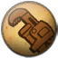 | 18 | 18 | 20 | 17 | 18 | 19 | 18 | 18 | 19 | 18 |
|  | 19 | 19 | 21 | 18 | 19 | 20 | 19 | 19 | 20 | 19 |  
| 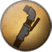 | 20 | 20 | 22 | 19 | 20 | 21 | 20 | 20 | 21 | 20 |  
| 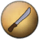 | 21 | 21 | 23 | 20 | 21 | 22 | 21 | 21 | 22 | 21 |  
|  | 22 | 22 | 24 | 21 | 22 | 23 | 22 | 22 | 23 | 22 |  
| 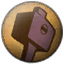 | 23 | 23 | 25 | 22 | 23 | 24 | 23 | 23 | 24 | 23 |  
|  | 24 | 24 | 26 | 23 | 24 | 25 | 24 | 24 | 25 | 24 |  
|  | 25 | 25 | 27 | 24 | 25 | 26 | 25 | 25 | 26 | 25 |  
|  | 26 | 26 | 28 | 25 | 26 | 27 | 26 | 26 | 27 | 26 |  
| 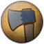 | 27 | 27 | 29 | 26 | 27 | 28 | 27 | 27 | 28 | 27 |

# Unique Ids

>  = Used.
> Those ids are already written as masks. Look above for the given masks and their ids.

| ID | Blanche | Naledi | Jacob | Barbara | Buck | Zigo | Danny | Oscar | Suresh | Louie |
|:-------:|:-------:|:------:|:-----:|:-------:|:----:|:----:|:-----:|:-----:|:------:|:-----:|
| 0 | 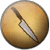 |  |  |  |  |  |  |  | 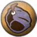 | 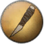 |
| 1 |  |  | 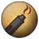 |  |  |  |  |  | 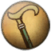 |  |
| 2 |  |  |  |  |  |  |  |  |  |  |
| 3 |  |  |  |  |  | |  |  |  |  |

# Examples
Using the above tables as a reference, let's try using this in a real world context.

## Example 1

What if I want to use Zigo with no hat and the Fisherman Hat as his melee?

Looking at the tables you can use **19** as the mask id and **0** as his melee id.
In your `User_yoursteamidhere.ini` file the values would look like so:

        UserProfileCharacterId=5
        UserProfileMaskIndex=19
        UserProfileMeleeWeaponIndex=0
        UserProfileRebirthCount=0

**5** being Zigo's id, **19** being the id for the Wrench, and **0** being the id for the Fisherman Hat.

### Screenshot
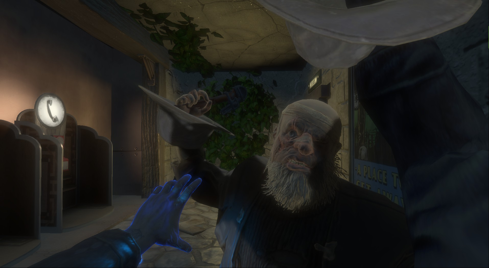

## Example 2

What if I want to use the Football as a melee as Danny with the Golden Bucket?

Looking at the table once more. You can use **29** as the mask id and **1** as the melee id.
In your `User_yoursteamidhere.ini` file the values would look like so:

        UserProfileCharacterId=6
        UserProfileMaskIndex=29
        UserProfileMeleeWeaponIndex=1
        UserProfileRebirthCount=1

### Screenshot
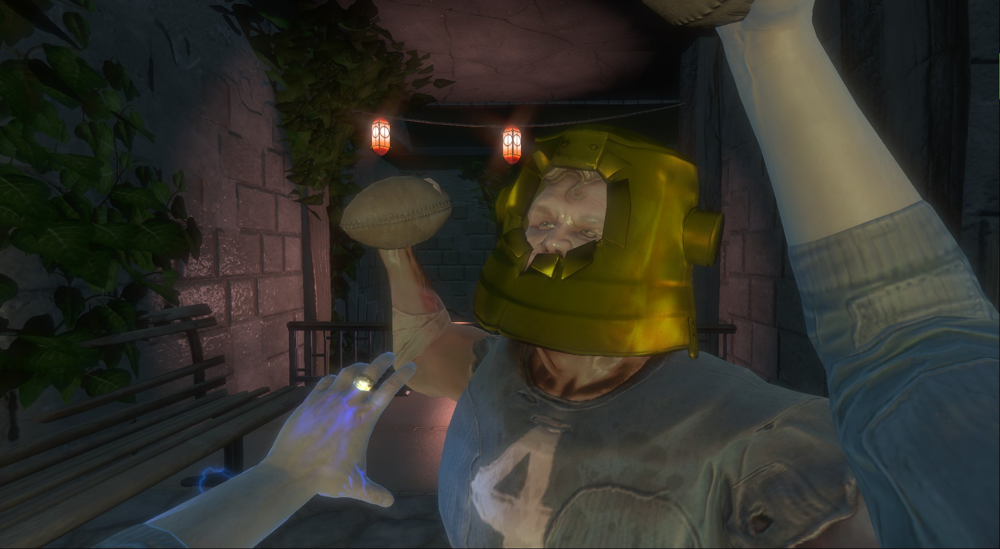

## Example 3

Enough of the crazy combos. How about a normal Combo.

Let's simply change Barbara to use the Starfish with the Hatchet.
The Starfish id for Barbara is **14** and the Hatchet id is **26**
In your `User_yoursteamidhere.ini` file the values would look like so:

        UserProfileCharacterId=3
        UserProfileMaskIndex=14
        UserProfileMeleeWeaponIndex=26
        UserProfileRebirthCount=26

### Screenshot
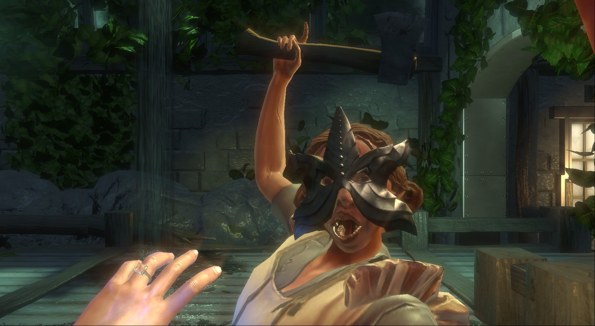

# Notes
1. Using a melee as a mask will end up moving the melee near your weapon and onto your arm. People can see this discrepancy.
2. You are able to wear the Golden Masks early with this method, bypassing the Rebirth requirement entirely.
3. With the default masks if you are not a high enough level you will get a DLC Requirements Error Message at the Main Menu.
    - Your mask will be reverted into the default mask for your character.
